## Name

Private School System

## Description

~ Java SE Application ~\
A Private School System Simulator where following functionalities are implemented:\
\
&emsp;&#8226;&emsp;Print a list of all the students\
\
&emsp;&#8226;&emsp;Print a list of all the trainers\
\
&emsp;&#8226;&emsp;Print a list of all the assignments\
\
&emsp;&#8226;&emsp;Print a list of all the courses\
\
&emsp;&#8226;&emsp;Print all the students per course\
\
&emsp;&#8226;&emsp;Print all the trainers per course\
\
&emsp;&#8226;&emsp;Print all the assignments per course\
\
&emsp;&#8226;&emsp;Print all the assignments per student\
\
&emsp;&#8226;&emsp;Print a list of students that belong to more than one courses\
\
&emsp;&#8226;&emsp;Based on user's given date, print a list of students who need to submit one or more assignments on the same &emsp;&nbsp;calendar week as the given date\
\
All results can be based on synthetic data provided by the application if user doesn't want to provide any.

## Demonstration

Starting the application it will ask the user if he/she wants to add data for the presentation or use synthetic data.

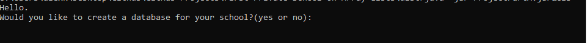

#### Choosing to insert data

First user is asked to add a student starting with his first name.

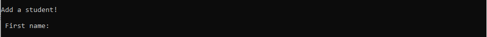

Next user is asked to fill the rest of student's information.

After providing all of student's information, user has the option to add another student.

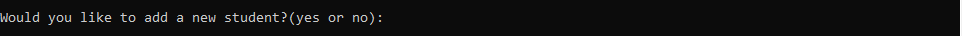

The steps for providing a trainer and an assignment to the application are pretty much the same.

When its time to add a course, after providing basic course's information, user is asked if he/she would like to associate this course to any of the trainers.

If yes, a list of trainers is demonstrated and the user can choose a number of trainers added to associate this course with.

Same procedure for assignments

and students.

After that user is asked if he/she wants to add another course. If not, the presentation (of the data provided) can begin.

For the sake of this demonstration syntetic data provided in the application are used.

#### Presentation

The presentation list for user to choose.

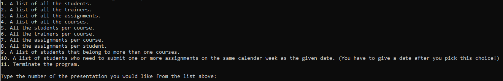

##### Option 1

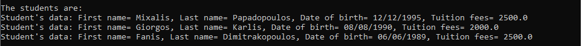

##### Option 2

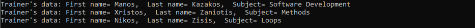

##### Option 3

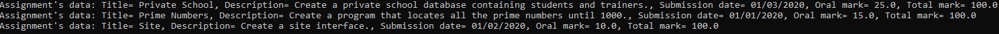

##### Option 4

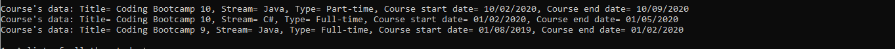

##### Option 5

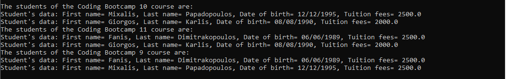

##### Option 6

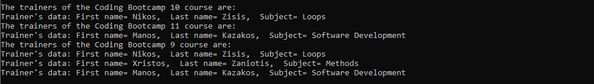

##### Option 7

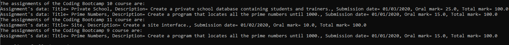

##### Option 8

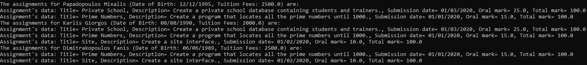

##### Option 9

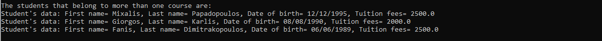

##### Option 10

If user picks option no. 10 he/she must provide a date, so the system can search for assignments need to be submitted on the same week.
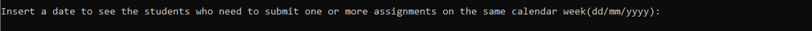
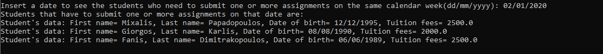

##### Option 11

